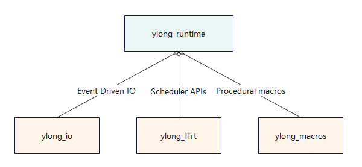
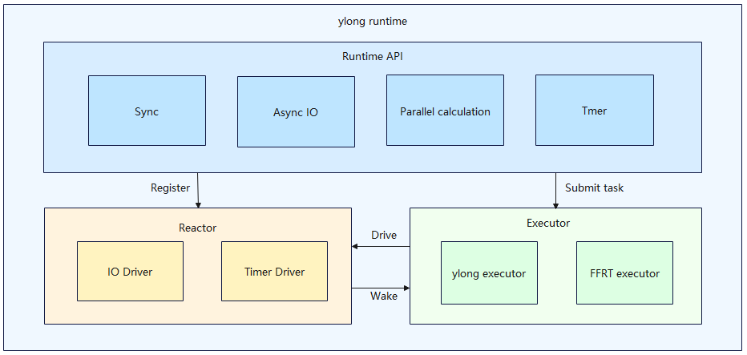

# ylong_runtime

## Introduction
Rust asynchronous runtime, provides functionalities such as spawning async tasks, async io, synchronization, parallel calculation.

### Overall structure


### Crates inner relations


ylong_runtime depends on the other three crates.
- ylong_io: provides event-driven net io, using epoll or iocp to achieve non-blocking tcp or udp
- ylong_ffrt: provides function flow runtime APIs. It serves as an alternative scheduler for ylong_runtime.
- ylong_macros: provides procedural macros for `select!`.

### Runtime framework


ylong_runtime's APIs could be divided into four different modules:
- Sync: Synchronization mechanism.
- Async IO: Asynchronous net IO and file IO.
- Parallel Calculation: Parallel iterator and concurrent calculation.
- Timer: Asynchronous timer.

For inner layer, there are Reactor and Executor:
- Reactor: Listens to system events such as IO and also timer events. Wakes the corresponding tasks through the events.
- Executor: Schedules and executes each tasks. There are two interchangeable executors for the runtime.

## Compile Build

Method 1: Introduce ylong_runtime in Cargo.toml

```toml
#[dependencies]
ylong_runtime = { git = "https://gitee.com/openharmony-sig/commonlibrary_rust_ylong_runtime.git", features = ["full"]}
```

For compiling FFRT version of ylong_runtime, rename ``ylong_ffrt/build_ffrt.rs`` to ``ylong_ffrt/build.rs``, and export `LD_LIBRARY_PATH`

Method 2: Add dependencies to BUILD.gn where appropriate

```
deps += ["//commonlibrary/rust/ylong_runtime/ylong_runtime:lib"]
```

## directory
```
ylong_runtime
|── docs                            # User guide
|── figures                         # Structure figures in docspo
|── patches                         # Patches for ci
|── ylong_ffrt
|    └── src                        # FFRT rust ffi
|── ylong_io
|    |── exmaples                   # Examples of ylong_io 
|    |── src                        # Source code of ylong_io
|    |    └── sys                   # OS specific implementation
|    |         |── linux            # Epoll driven io
|    |         └── windows          # Iocp driven io
|── ylong_runtime                   
|    |── benches                    # Benchmarks of ylong_runtime
|    |── examples                   # Examples of ylong_runtime
|    |── src                        # Source code of ylong_runtime
|    |    |── builder               # Runtime builder
|    |    |── executor              # Runtime executor
|    |    |── ffrt                  # FFRT adapter
|    |    |── fs                    # Async fs components
|    |    |── io                    # Async io traits and components
|    |    |   └── buffered          # Async BufReader and BufWriter
|    |    |── iter                  # Async parallel iterator
|    |    |   |── parallel          # ParIter implementation for data containers
|    |    |   └── pariter           # Core of pariter
|    |    |── net                   # Async net io and net driver
|    |    |   └── sys               # Async system io
|    |    |       └── tcp           # Async Tcp
|    |    |── sync                  # Runtime synchronization components
|    |    |   └── mpsc              # Mpsc channels
|    |    |── task                  # Async task components
|    |    |── time                  # Timer components
|    |    └── util                  # Utilities
|    |        |── core_affinity     # Vore affinity components
|    |        └── num_cpus          # Num cpus components
|    └── tests                      # Sdv of ylong_runtime
└── ylong_runtime_macros
     |── examples                   # Examples of ylong_macro
     └── src                        # Procedural macro implementation for runtime
```

## Usage

### `ylong` global thread pool

```rust
use std::net::{Ipv4Addr, SocketAddrV4};
use ylong_runtime::io::*;
use ylong_runtime::net::TcpListener;
fn main() -> std::io::Result<()> {
    ylong_runtime::block_on(async {
        let ip = Ipv4Addr::new(127, 0, 0, 1);
        let addr = SocketAddrV4::new(ip, 8080);
        let listener = TcpListener::bind(addr.into()).await?;
        loop {
            let (mut stream, _) = listener.accept().await?;
            stream.write_all("hello ylong".as_bytes());
        }
    })
}
```


#### Thread pool settings

Users can set the config of the runtime, which must be set before `block_on` and `spawn`, otherwise `runtime` will use the default configuration.

```rust
fn main() {
    let _ = ylong_runtime::builder::RuntimeBuilder::new_multi_thread()
        .worker_stack_size(10)
        .keep_alive_time(std::time::Duration::from_secs(10))
        .build_global();
    
    let fut = async {

    };
    let _ = ylong_runtime::block_on(fut);
}
```

### `ylong` scheduling framework non-asynchronous thread pool (spawn_blocking)

```rust
fn main() {
    let fut = async {
        // It could be a closure or function.
        let join_handle = runtime.spawn_blocking(|| {});
        // Waits the task until finished.
        let _result = join_handle.await;
    };
    let _ = ylong_runtime::block_on(fut);
}
```


### ParIter Introduction

ParIter and its related interfaces are defined in the module `ylong_runtime::iter`. `ParIter` supports parallel iterations over threads, where a set of data is split and the split data performs the operations in the iterator in parallel over the threads.

```rust
use ylong_runtime::iter::prelude::*;

fn main() {
    ylong_runtime::block_on(fut());
}

async fn fut() {
    let v = (1..30).into_iter().collect::<Vec<usize>>();
    let sum = v.par_iter().map(|x| fibbo(*x)).sum().await.unwrap();
    println!("{}", sum);
}

fn fibbo(i: usize) -> usize {
    match i {
        0 => 1,
        1 => 1,
        n => fibbo(n - 1) + fibbo(n - 2),
    }
}
```

## User Guide

See [user_guide](./docs/user_guide.md)

## Acknowledgements

Based on the user's habit, the API of this library, after changing the original Rust standard library synchronous interface implementation to asynchronous, retains the original naming style of the standard library, such as``TcpStream::connect``, ``File::read``, ``File::write`` and so on. We also refer to some of Tokio's general API design ideas, and we would like to express our gratitude to the Rust standard library and Tokio